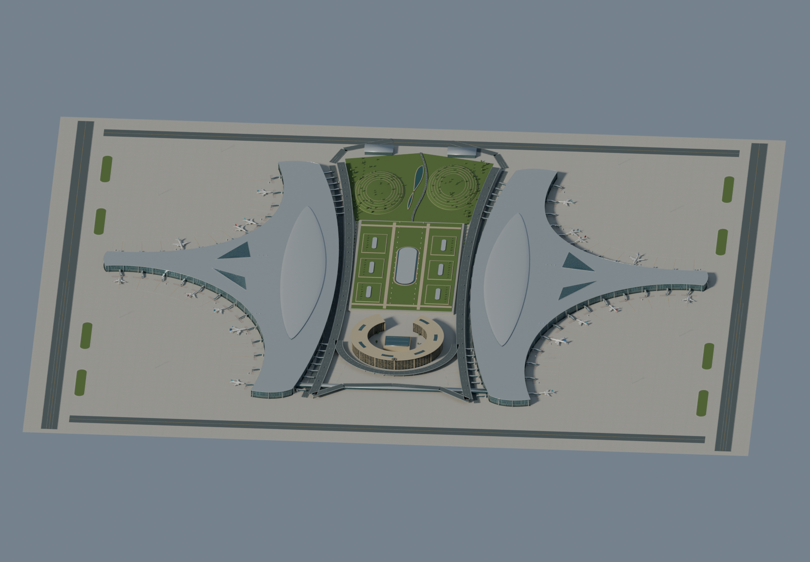
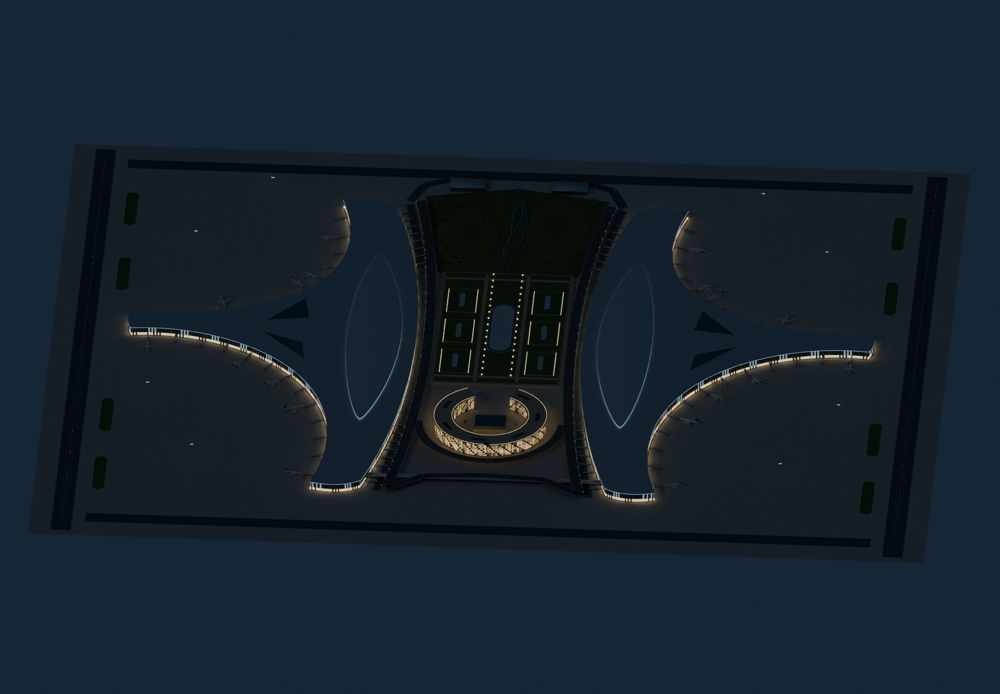
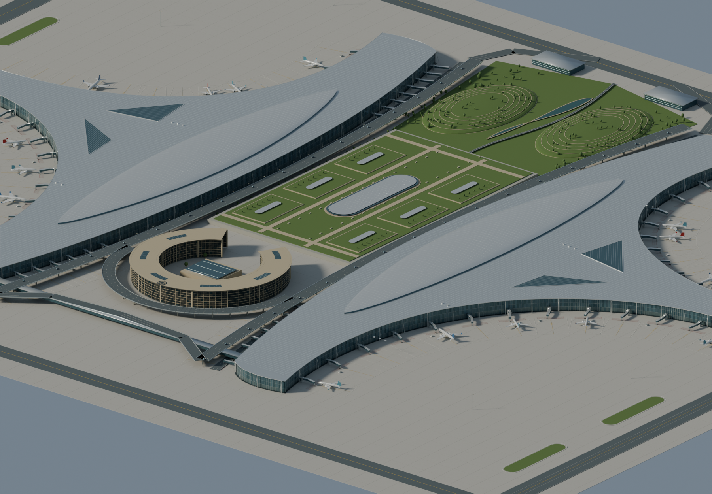

# 成都天府国际机场 · Chengdu Tianfu International Airport

以建成状态航拍、卫星照片为基础的机场航站区建筑可视化作品。使用 Blender 5.2.1 LTS 和已安装 Blender MCP 创建全部几何。保留双航站楼“太阳神鸟”构型、六条弧形指廊、抬升羽状屋面、中央环形建筑及 GTC 景观轴；细节采用照片近似，适用于作品展示，不作为测绘或施工模型。

## 下载与预览

- [GLB 在线资产](https://sample-data-jt.vercel.app/chengdu-tianfu-airport/chengdu-tianfu-airport.glb)
- `chengdu-tianfu-airport.blend`：可编辑源文件，保留独立展示相机与太阳光。
- `build_model.py`：可重复执行的完整建模脚本。
- `preview-day.png`、`preview-night.png`：同一构图的昼夜展示。
- `preview-detail.png`、`preview-plan.png`：局部近景、俯视布局。
- `placement.json`：Geo 放置参数。
- `validation.json`、`gltf-validator-report.json`：结构与 Khronos 验证报告。

## 几何与细节

两座连续 Y 形曲面航站楼，银色立缝金属屋顶、羽状抬升屋面与玻璃侧天窗、三角庭院天窗、分层玻璃幕墙、幕墙竖梃与横梁、外侧支撑、83 组折线登机桥与机位地面标线、18 架原创简化客机、机坪高杆灯、地勤车与道路车辆。中央包含带开放庭院的 C 形环楼、水平楼层遮阳带、屋顶太阳神鸟图案、GTC 植被露台与胶囊天窗、双侧高架道路、南侧航站楼连桥、北侧坡地公园、等高线式步道、树木与水景。

GLB 共 37 个材质网格，525,239 个三角面，27,331,088 字节（26.1 MiB）。按材质合并以限制绘制批次；所有外观为标准 PBR 材质，无第三方模型、照片纹理或外部资源依赖。83 为本次造型中的近机位组数，具体编号和位置属于展示性布置。

## Geo 昼夜规范

2026-09-30 核对 [Cyber-Sight 外部模型统一渲染标准](https://github.com/tanghaojie/Cyber-Sight/blob/master/docs/platform/design/modules/geo-model-rendering.md)。六类 Emissive 分别用于航站楼门厅、候机窗格、屋面轮廓、中央环楼窗灯、景观灯与滑行道绿灯。使用 `KHR_materials_emissive_strength` 保留强度比例，无必需扩展、Unlit、嵌入摄像机、灯光扩展或 Bloom。

Geo 根据模型位置及仿真时间计算太阳高度；大于等于 +2° 为白天、小于等于 -6° 为夜间，中间平滑过渡。白天 Emissive 关闭，夜间恢复。Blender 展示图关闭白天发光、恢复夜间发光，并使用独立展示照明；这些图不是 Cesium GPU 验收。

Blender 米制 Z-up，导出标准 glTF Y-up。地面原点高度为 0，模型包围盒为 2100 × 1740 × 37.93 m；场地范围与尺寸为照片近似。

在 [Geo 在线工作台](https://cyber-sight-geo.vercel.app/geo.html) 中选择“数据 → 外部数据”，输入在线 GLB URL、经度 `104.441`、纬度 `30.313`、椭球高 `0`，缩放与姿态使用 `1 / 0 / 0 / 0`。坐标为机场航站区近似位置，朝向为展示默认值，精确配准需另行校核。仿真时间明确为 UTC：成都中午可使用 `2026-09-30 04:00 UTC`，夜景可使用 `12:00 UTC`。

## 验证状态

- Khronos glTF Validator：0 错误、0 警告、0 提示。
- 检查二进制结构、有限坐标、法线长度、索引范围、米制包围盒与原点、材质发光、83 组登机桥数量；通过。
- Blender 最终四张渲染图已生成并视觉检查。
- Chrome 最初成功打开在线 Geo 页面与外部数据面板，之后扩展连接中断。桌面控制无法可靠确认当前网址而停止，因此在线模型加载和 Cesium 昼夜视觉验收尚未完成。

## 参考

- 用户提供的 13 张参考图，主要采用建成航拍 `3/4/5/9/10`、卫星图 `0/8`；早期方案图只用于理解构型，没有作为建成屋面直接照搬。用户图片仅供参考，不随本目录重新发布。
- [中国建筑西南设计研究院提供的项目说明与实景照片](https://www.gooood.cn/chengdu-tianfu-international-airport-by-cswadi.htm)：手拉手构型、三指港湾、GTC 与建成状态。
- [中国建筑：T1 航站楼建成说明](https://en.cscec.com/CompanyNews/CorporateNews/202104/3302418.html)：幕墙及建筑尺度。
- [ICAO：成都天府国际机场介绍](https://www.icao.int/APAC/Meetings/2023%20APADOTF4/IP04%2C%20AI%202%20-%20INTRODUCTION%20OF%20CHENGDU%20TIANFU%20INTERNATIONAL%20AIRPORT_China.pdf)：双航站楼及 83 个近机位。

## 复现

`build_model.py` 可在 Blender 脚本编辑器运行，或通过 `mcp_client.py execute_blender_code build_model.py` 使用本机既有 Blender MCP；脚本中的工作区路径需按环境调整。脚本只重建自己创建的 `TFU_Architectural_Portfolio` 场景，保留用户无关场景。`render_preview.py` 使用 Blender 后台加载源文件生成展示图。`node validate_glb.cjs` 生成结构检查报告；Khronos 报告使用官方 `gltf-validator` 包。
